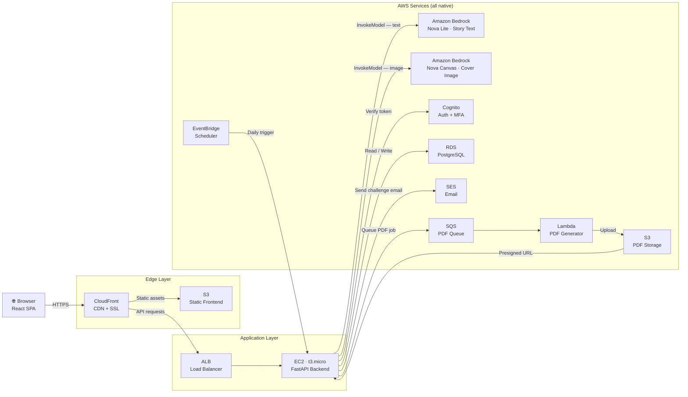

# AI Story Prompt Generator
## Executive Summary

An AI-powered web application that generates creative story prompts from user input. Users provide a short description — genre, characters, setting — and the application returns a 400–500 word story prompt suitable for writers, game masters, and content creators. The app includes AI-generated story covers, PDF export, user authentication for saving prompts, a daily writing challenge system, writing streak tracking, and prompt collections.

---

## Architecture Overview

---

## Infrastructure Components

### AWS Services Reference

| Component | Service | Tier | Purpose |
|-----------|---------|------|---------|
| CDN + SSL | CloudFront | Free tier | Caches static assets, terminates HTTPS |
| Static hosting | S3 | Free tier | Serves the compiled React app |
| Load balancing | ALB | **Paid ~$16/mo** | Distributes traffic to EC2 |
| Backend | EC2 t3.micro | Free tier (12 mo.) | Runs FastAPI application server |
| **AI model — text** | **Amazon Bedrock — Nova Lite** | **Pay-per-token · very low cost** | **Generates story prompts — Amazon's own creative storytelling model** |
| **AI model — image** | **Amazon Bedrock — Nova Canvas** | **Pay-per-image · ~$0.04/image** | **Generates story cover art from the prompt description** |
| Authentication | Cognito | Free tier (50k MAU) | User sign-up, login, MFA, social OAuth |
| Database | RDS PostgreSQL db.t3.micro | Free tier (12 mo.) | Persists users, prompts, streaks, collections |
| PDF queue | SQS | Free tier (1M req.) | Decouples async PDF jobs from API response |
| PDF generation | Lambda | Free tier (1M req.) | Generates PDF from Markdown, uploads to S3 |
| PDF storage | S3 | Free tier | Stores exported PDF files |
| Daily challenge | EventBridge Scheduler | Free tier | Triggers challenge generation every morning |
| Email delivery | SES | Free tier (3k/day) | Sends daily writing challenge emails |

