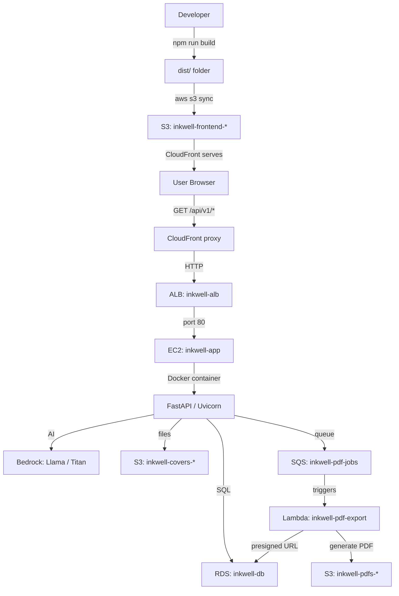

# Inkwell Terraform & Deployment Guide

## What is Terraform?

Terraform is "infrastructure as code" — instead of clicking buttons in the AWS
console to create servers, databases, and networking, you write `.tf` config
files that declare what you want. Running `terraform apply` creates or updates
everything to match the files. All changes are tracked in a state file.

## File-by-File Breakdown

### `main.tf` — Root configuration

```hcl
terraform {
  required_providers {
    aws = {
      source  = "hashicorp/aws"
      version = "~> 5.0"
    }
  }
  backend "s3" {
    bucket = "inkwell-terraform-state-abemm"
    key    = "prod/terraform.tfstate"
    region = "us-east-1"
  }
}

provider "aws" {
  region = "us-east-1"
}

locals {
  name_prefix = "inkwell"
}
```

| Lines | What it does |
|---|---|
| 1-13 | Declares the **AWS provider** (v5.x) and configures a **remote backend** — the `.tfstate` file lives in S3 (`inkwell-terraform-state-abemm`) so multiple people can share it |
| 15-17 | Tells Terraform to use **us-east-1** for all resources |
| 19-21 | Defines a **local variable** `name_prefix = "inkwell"` used to name every resource consistently |

> **In AWS Console**: The state bucket is at **S3 → `inkwell-terraform-state-abemm`**.
> This is NOT a deployed app resource — it's Terraform's own storage.

---

### `network.tf` — VPC, subnets, gateways, security groups

```hcl
resource "aws_vpc" "main" {
  cidr_block           = "10.0.0.0/16"
  enable_dns_hostnames = true
  enable_dns_support   = true
}

resource "aws_internet_gateway" "main" {
  vpc_id = aws_vpc.main.id
}

resource "aws_subnet" "public" { ... }  # 2 public subnets (10.0.0.0/24, 10.0.1.0/24)
resource "aws_subnet" "private" { ... } # 2 private subnets (10.0.10.0/24, 10.0.11.0/24)

resource "aws_eip" "nat" { domain = "vpc" }    # Elastic IP for NAT Gateway
resource "aws_nat_gateway" "main" { ... }       # NAT in public subnet for private subnet internet

resource "aws_route_table" "public"  { ... }    # Public: 0.0.0.0/0 → Internet Gateway
resource "aws_route_table" "private" { ... }    # Private: 0.0.0.0/0 → NAT Gateway

resource "aws_security_group" "ec2" { ... }     # EC2: port 80 from VPC, port 22 from everywhere
resource "aws_security_group" "alb" { ... }     # ALB: ports 80, 443 from internet
resource "aws_security_group" "rds" { ... }     # RDS: port 5432 from EC2 + Lambda only
resource "aws_security_group" "lambda" { ... }  # Lambda: outbound internet only
```

| Resource | AWS Console path | Name |
|---|---|---|
| VPC | VPC → Your VPCs | `inkwell-vpc` |
| Public subnets | VPC → Subnets (filter `inkwell-public`) | `inkwell-public-0`, `inkwell-public-1` |
| Private subnets | VPC → Subnets (filter `inkwell-private`) | `inkwell-private-0`, `inkwell-private-1` |
| Internet Gateway | VPC → Internet Gateways | `inkwell-igw` |
| NAT Gateway | VPC → NAT Gateways | `inkwell-nat` |
| Elastic IP | VPC → Elastic IPs | (associated with NAT) |
| Route tables | VPC → Route Tables | `inkwell-public-rt`, `inkwell-private-rt` |
| EC2 Security Group | EC2 → Security Groups | `inkwell-ec2-sg` |
| ALB Security Group | EC2 → Security Groups | `inkwell-alb-sg` |
| RDS Security Group | EC2 → Security Groups | `inkwell-rds-sg` |
| Lambda Security Group | EC2 → Security Groups | `inkwell-lambda-sg` |

---

### `ec2.tf` — The backend server + load balancer

This is the most complex file. It creates:

**IAM (permissions):**
- An **IAM role** `inkwell-ec2-role` that the EC2 instance assumes
- Attaches policies: **Bedrock** (AI), **ECR** (pull Docker images), **SQS+S3** (send messages, upload files)

**EC2 instance:**
- Amazon Linux 2023, `t3.micro`, in public subnet
- **`credit_specification { cpu_credits = "unlimited" }`** — avoids CPU credit starvation
- Attaches the IAM role + SSH key (`inkwell-key`)
- **`user_data`** — a script (userdata.sh) that runs on first boot:
  1. Installs Docker
  2. Logs into ECR
  3. Writes `.env` file with DB credentials, Cognito IDs, S3 bucket names, SQS URL
  4. Runs the backend Docker container (`inkwell/backend:latest`) on port 80
  5. Retries up to 6 times until the health check passes

**Application Load Balancer:**
- `inkwell-alb` — public-facing, ports 80/443
- Target group `inkwell-tg` — forwards to EC2 on port 80
- Health check at `/api/v1/health`

| Resource | AWS Console path | Name |
|---|---|---|
| EC2 Instance | EC2 → Instances | `inkwell-app` |
| IAM Role | IAM → Roles | `inkwell-ec2-role` |
| IAM Instance Profile | IAM → Instance profiles | `inkwell-ec2-profile` |
| Key Pair | EC2 → Key Pairs | `inkwell-key` |
| ALB | EC2 → Load Balancers | `inkwell-alb` |
| Target Group | EC2 → Target Groups | `inkwell-tg` |
| Listener | EC2 → Load Balancers → `inkwell-alb` → Listeners | (HTTP:80 default) |
| IAM Policy (ECR) | IAM → Policies | `inkwell-ecr-pull` |
| IAM Policy (SQS+²S3) | IAM → Policies | `inkwell-ec2-sqs-s3` |

---

### `rds.tf` — PostgreSQL database

```hcl
resource "aws_db_subnet_group" "main" {
  subnet_ids = aws_subnet.private[*].id   # DB lives in private subnets
}

resource "aws_db_instance" "main" {
  engine         = "postgres"
  engine_version = "16"
  instance_class = "db.t3.micro"
  allocated_storage = 20
  db_name        = "inkwell"
  username       = "inkwell"
  password       = random_password.db.result   # Random 24-char password
  skip_final_snapshot = true
}

resource "random_password" "db" { length = 24; special = false }
```

| Resource | AWS Console path | Name |
|---|---|---|
| RDS Instance | RDS → Databases | `inkwell-db` |
| DB Subnet Group | RDS → Subnet groups | `inkwell-db-subnet-group` |
| (Password stored in Terraform state) | — | — |

---

### `lambda.tf` — PDF export worker

Creates:

1. **IAM role** `inkwell-pdf-lambda-role` — Lambda assumes this
2. Attaches policies:
   - `AWSLambdaSQSQueueExecutionRole` — read from SQS
   - `AWSLambdaVPCAccessExecutionRole` — access private subnets
   - Custom `inkwell-pdf-lambda-extra` — `s3:PutObject` + `s3:GetObject` on PDFs bucket, `rds-data:*` on the DB
3. **Lambda function** `inkwell-pdf-export` (Python 3.12):
   - Zipped code from `lambda/pdf_export/`
   - Timeout: 120s, Memory: 512MB
   - In VPC private subnets — can reach RDS directly
   - Environment: `DATABASE_URL`, `S3_PDFS_BUCKET`, `SQS_PDF_QUEUE_URL`
4. **SQS event source mapping** — triggers Lambda when messages appear in queue

| Resource | AWS Console path | Name |
|---|---|---|
| Lambda | Lambda → Functions | `inkwell-pdf-export` |
| IAM Role | IAM → Roles | `inkwell-pdf-lambda-role` |
| IAM Policy | IAM → Policies | `inkwell-pdf-lambda-extra` |

---

### `queue.tf` — SQS for PDF jobs

```hcl
resource "aws_sqs_queue" "pdf_jobs" {         # Main queue
  redrive_policy = jsonencode({               # After 3 failures →
    deadLetterTargetArn = ...dlq.arn          # move to DLQ
    maxReceiveCount = 3
  })
}
resource "aws_sqs_queue" "pdf_jobs_dlq" { }   # Dead-letter queue
```

| Resource | AWS Console path | Name |
|---|---|---|
| SQS Queue | SQS → Queues | `inkwell-pdf-jobs` |
| DLQ | SQS → Queues | `inkwell-pdf-jobs-dlq` |

---

### `bedrock.tf` — AI permissions

Creates an IAM policy `inkwell-bedrock-policy` allowing `bedrock:InvokeModel` on
specific models in **us-west-2** (Llama 3.1 8B, Llama 3.1 70B, Llama 3.2 3B,
Titan Text Express, Titan Image Generator v2).

This policy is attached to the EC2 role (so the backend can call Bedrock).

| Resource | AWS Console path | Name |
|---|---|---|
| IAM Policy | IAM → Policies | `inkwell-bedrock-policy` |

---

### `cognito.tf` — User authentication

Creates:

1. **User pool** `inkwell-user-pool` — users sign up with email, email auto-verified
2. **App client** `inkwell-client` — OAuth2 with authorization code grant, callback URLs
   to `localhost:5173` and CloudFront domain
3. **Domain** `inkwell-w41md334` — the hosted UI lives at `inkwell-w41md334.auth.us-east-1.amazoncognito.com`
4. **UI customization** — applies a custom CSS file to style the login page

| Resource | AWS Console path | Name |
|---|---|---|
| User Pool | Cognito → User Pools | `inkwell-user-pool` (`us-east-1_BZfwBvG99`) |
| App Client | Cognito → User Pools → `inkwell-user-pool` → App Integration | `inkwell-client` |
| Domain | Cognito → User Pools → `inkwell-user-pool` → App Integration → Domain | `inkwell-w41md334` |

---

### `storage.tf` — S3 buckets

Two buckets:

**`inkwell-covers-*`** (public-read):
- Stores AI-generated cover images
- Bucket policy allows anyone (`Principal: "*"`) to `GetObject`
- Disabled public-access blocks

**`inkwell-pdfs-*`** (private):
- Stores exported PDFs
- No public access — accessed via presigned URLs

| Resource | AWS Console path | Name |
|---|---|---|
| Covers bucket | S3 → Buckets | `inkwell-covers-w41md334` |
| PDFs bucket | S3 → Buckets | `inkwell-pdfs-w41md334` |

---

### `frontend.tf` — S3 + CloudFront for the web app

Creates:

1. **S3 bucket** `inkwell-frontend-*` — stores the built React app (index.html, JS, CSS)
2. **CloudFront distribution** — edge CDN that:
   - Serves `/*` from S3 (the static frontend)
   - Proxies `/api/*` to the ALB (the backend)
   - HTTPS-only for API calls (`viewer_protocol_policy = "https-only"`)
   - Forwards `Authorization`, `Content-Type`, `Origin` headers to the API
   - Redirects HTTP → HTTPS for the frontend
   - Custom 404 → serves index.html (for SPA routing)
3. **Origin Access Identity** — CloudFront identity that has `s3:GetObject` on the bucket

| Resource | AWS Console path | Name |
|---|---|---|
| S3 Bucket | S3 → Buckets | `inkwell-frontend-w41md334` |
| CloudFront | CloudFront → Distributions | `E397E0DGQHLEOX` |
| OAI | CloudFront → Origin Access | `inkwell-oai` |

---

### `ses.tf` — Email (optional)

Verifies the domain `inkwell.app` in SES and creates an IAM policy allowing
the EC2 role to send emails. Not actively used yet.

| Resource | AWS Console path | Name |
|---|---|---|
| SES Identity | SES → Verified identities | `inkwell.app` |
| IAM Policy | IAM → Policies | `inkwell-ses-send` |

---

### `events.tf` — Scheduled tasks

Creates a CloudWatch EventBridge rule `inkwell-daily-challenge` that fires
at 06:00 UTC daily (`cron(0 6 * * ? *)`). Intended to trigger a Lambda or
internal API call to seed a new daily writing challenge. Not fully wired up yet.

| Resource | AWS Console path | Name |
|---|---|---|
| EventBridge Rule | CloudWatch → Rules | `inkwell-daily-challenge` |

---

### `outputs.tf` — Useful values

After `terraform apply`, displays the DNS names and IDs you need for the frontend:

| Output | What it gives you |
|---|---|
| `alb_dns` | `inkwell-alb-899188867.us-east-1.elb.amazonaws.com` |
| `cloudfront_domain` | `d3k5tpcaie4g6y.cloudfront.net` |
| `cognito_user_pool_id` | `us-east-1_BZfwBvG99` |
| `cognito_client_id` | `5augkbidsu5ohemg0lq9r3hla6` |
| `cognito_domain` | `inkwell-w41md334` |
| `rds_endpoint` | `inkwell-db.c2lm6oqayho4.us-east-1.rds.amazonaws.com` |
| `s3_covers_bucket` | `inkwell-covers-w41md334` |
| `s3_pdfs_bucket` | `inkwell-pdfs-w41md334` |
| `sqs_pdf_queue_url` | `https://sqs.us-east-1.amazonaws.com/.../inkwell-pdf-jobs` |
| `frontend_s3_bucket` | `inkwell-frontend-w41md334` |

Run `terraform output` in the `terraform/` directory to see these any time.

---

## How the Deployment Works



## The Steps We Took to Make It Functional

### Problem 1: EC2 not running properly
- **Issue**: t3.micro CPU credits at 0, Docker containers crash-looping, Ollama (unused AI model) eating CPU
- **Fix**: Removed Ollama from userdata.sh, added `credit_specification { cpu_credits = "unlimited" }`, added container retry loop
- **Command**: `terraform apply` — destroyed old EC2, created new one with updated AMI + fixed userdata

### Problem 2: PDF export failing
- **Issue**: Lambda had `s3:PutObject` but `generate_presigned_url("get_object")` also needs `s3:GetObject`
- **Fix**: Added `s3:GetObject` to both Lambda and EC2 IAM policies
- **Command**: `terraform apply` — updated IAM policies in-place

### Problem 3: Mixed content (HTTPS frontend, HTTP API)
- **Issue**: CloudFront served frontend on HTTPS, but `VITE_API_URL` pointed to HTTP ALB
- **Fix**: CloudFront already had `/api/*` cache behavior pointing to ALB. Rebuilt frontend with `VITE_API_URL=https://d3k5tpcaie4g6y.cloudfront.net/api/v1`

### Problem 4: Auth returning 500 instead of 401
- **Issue**: `except ValueError` only caught jose `ValueError`, but malformed tokens threw other exceptions
- **Fix**: Changed to `except Exception` in `security.py`

### Problem 5: Text hidden by overflow
- **Issue**: `CHARS_PER_PAGE = 1200` but the 360×500px flipbook page only fits ~770 chars of 14px Lora text
- **Fix**: Lowered to 770, rebuilt + deployed frontend